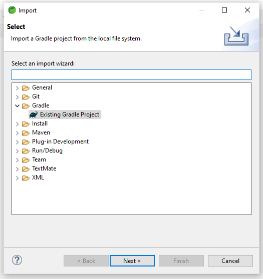
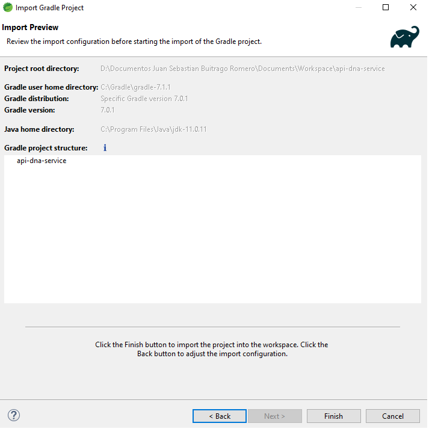

# api-dna-service
api rest to find mutants

#Versiones:
Gradle 7.0.1 
Java SE 11
DataBase: AWS dynamoDB

Nota: La DB se encuentra actualmente activa en AWS.

#Recomendaciones

La aplicacion se encuentra desplegada en AWS y cuenta con los siguientes enpoints:

1. POST:
Endpoint para registrar y verificar si eres humano o mutante por medio de una cadena ADN:
http://apidnaservice-env-1.eba-m2hkahqz.us-east-1.elasticbeanstalk.com/mutant/

JSON solicitado:
{
   "dna":["ATGCGA","CAGTGC","TTATTT","AAAAGG","GCGTAG","TCCCTG"]
}

2. GET:
Endpoint para consultar estadisticas de la cantidad 
http://apidnaservice-env-1.eba-m2hkahqz.us-east-1.elasticbeanstalk.com/stats/ 

#Instrucciones para ejecutar en local:

Las siguientes instrucciones se ejecutaron sobre STS 4( Spring tool Suite 4)

1. Descargar código fuente
2. Importar el proyecto como existente con gradle

3. Seleccionar la ruta del proyecto

4. Especificar la versión 7.0.1 de gradle y la ubicación de instalación tanto de Gradle como de JAVA. Haga clic en siguiente.

5. Por ultimo de click en finalizar. El proyecto intentará descargar las dependencias correspondientes.

#Enpoints para su ejecución en local:

1. POST:
Endpoint para registrar y verificar si eres humano o mutante por medio de una cadena ADN :
http//:localhost:8052/mutant/

JSON solicitado:
{
   "dna":["ATGCGA","CAGTGC","TTATTT","AAAAGG","GCGTAG","TCCCTG"]
}

2. GET:
Endpoint para consultar estadisticas de la cantidad 
http//:localhost:8052/stats/
